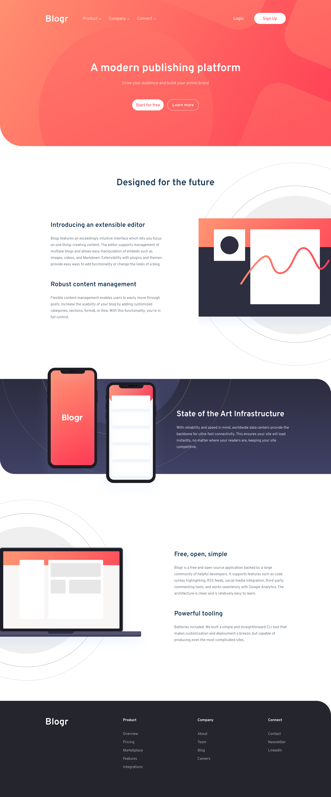

# Frontend Mentor - Blogr landing page solution

This is a solution to the [Blogr landing page challenge on Frontend Mentor](https://www.frontendmentor.io/challenges/blogr-landing-page-EX2RLAApP).

## Table of contents

- [Overview](#overview)
  - [The challenge](#the-challenge)
  - [Screenshot](#screenshot)
- [My process](#my-process)
  - [Built with](#built-with)
  - [What I learned](#what-i-learned)
  - [Continued development](#continued-development)
- [Author](#author)

## Overview

### The challenge

Users should be able to:

- View the optimal layout for the site depending on their device's screen size
- See hover states for all interactive elements on the page

### Screenshot

Desktop

## My process

### Built with

- React
- Sass

### What I learned

That was a lot harder than I had expected! It was my second time build an entire landing page and my first time doing so with SASS but even so, it took me a lot longer than I thought it would. I especially struggled with placing the background images where they need to be and clipping images to show them partially. That being said, I am now able to keep everything within a specific width and keep them centered so that the page doesn't keep growing horizontally along with the browser after a certain point.

### Continued development

Like I mentioned, I struggled with positioning the background images. I'm used to applying gradients over images and having the background be a specific color but I've never really had multiple backgrounds in different positions and sizes so I'll need to work on that aspect of web development.

## Author

- Website - [Hyun Don Moon](https://velog.io/@hyundonny)
- Frontend Mentor - [@hyundonny](https://www.frontendmentor.io/profile/hyundonny)
